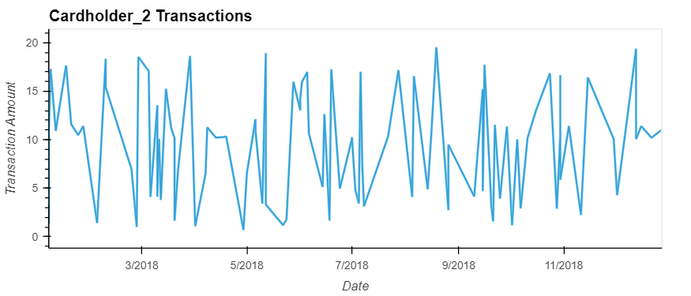
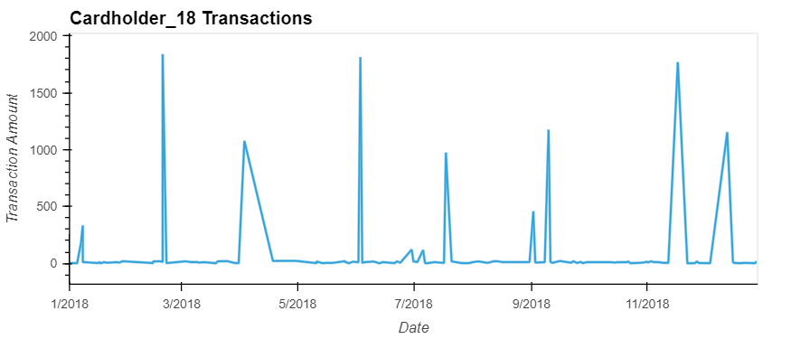
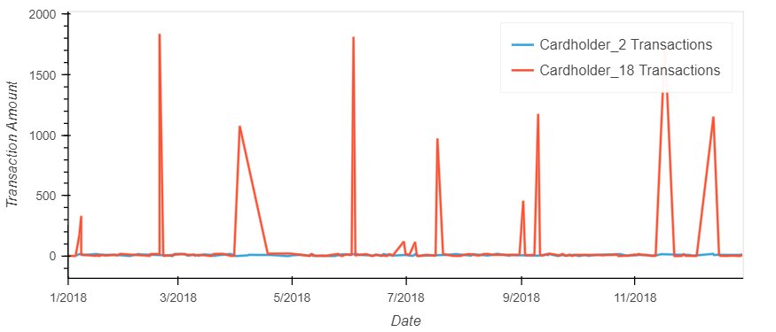
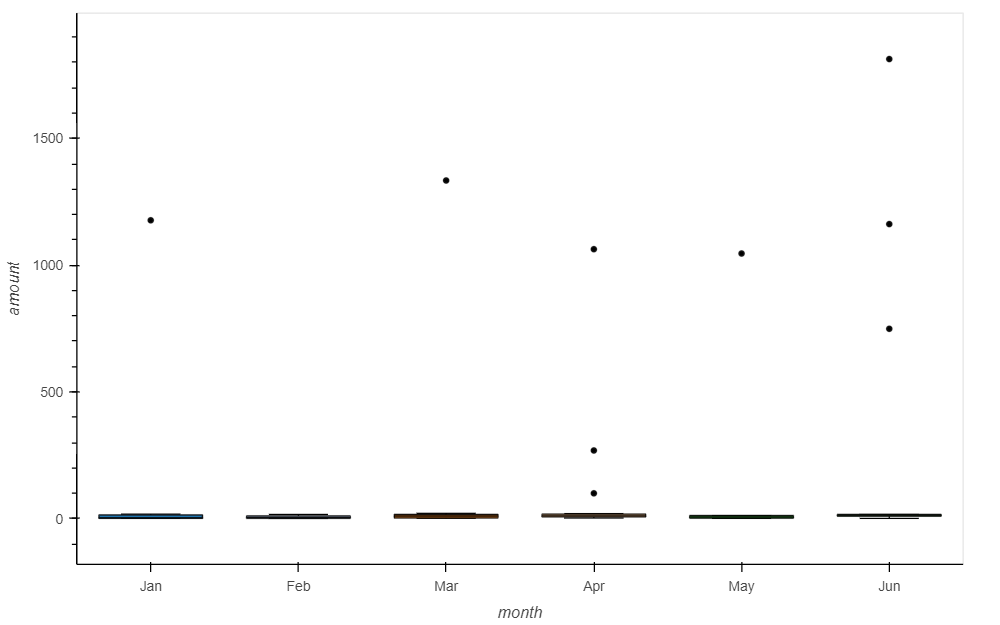

#  Data Analysis of Fraudulent Transaction

This homework assignment has applied SQL skills to analyze historical credit card transactions and consumption patterns in order to identify possible fraudulent transactions.

The main tasks accomplished are:

* Data Modeling: Defined a database model to store the credit card transactions data and created a new PostgreSQL database using that model.
* Data Engineering: Created a database schema on PostgreSQL and populated database from the CSV files.
* Data Analysis: Analyzed the data to identify possible fraudulent transactions and developed a report of observations.
 
 
Through these tasks a report has been prepared to help CEO of the firm to analyze potential fraudulent transactions. This report has been prepared based upon queries generated in query.sql file.

## Data Analysis (Part1)

### Some fraudsters hack a credit card by making several small transactions (generally less than $2.00), which are typically ignored by cardholders.

#### How can you isolate (or group) the transactions of each cardholder?

   Through Query # 1 a query is generated to group transactions of each card_holder by thier credit cards. This query provided information of each carholder's name their corresponding credit cards and the amount of total transactions done through those cards. It is significant to note that if a customer is using more than one credit card, the total amount transacted corresponds to each card.
   
#### Count the transactions that are less than $2.00 per cardholder.

   Query # 2 counts the transactions that are less than $2.00 per credit card of each cardholder.
   
#### Is there any evidence to suggest that a credit card has been hacked? Explain your rationale.

   The information generated through Query # 2 indicated that there are number of transactions that are less than $2.00 per credit card. In some instances the count of such transactions are even greater than 10. These numbers suggest that a credit card has been hacked.

#### Considering the time period in which potentially fraudulent transactions are made,

*  **What are the top 100 highest transactions made between 7:00 am and 9:00 am?** 
    Query # 3 joined the credit_card, cardholder and transaction table.Then through a conditional anaysis transactions made between 7 am to 9 am have been extracted. 
   
*  **Do you see any anomalous transactions that could be fraudulent?** 
   Yes, from the transactions made during 7 am to 9 am, information is further filtered out by extracting the transactions that were less than $ 2 and greater than $30 which revleaed that from these transactions about 9 transactions are more than $100 while 30 transactions are less than $2. This information makes that anomalous transactions could be fraudlent (see Query # 4).

*  **Is there a higher number of fraudulent transactions made during this time frame versus the rest of the day?** 
   100 potenetial fruadulent transactions made during rest of the day are more than $100 and around 320 transactions are less than $ 2 which makes the total number of fraudulent transactions made during the rest of the day higher than during 7 am to 9 am. However upon hourly basis, the morning time transactions are larger than rest of the day.

*  **If you answered yes to the previous question, explain why you think there might be fraudulent transactions during this time frame.** 
   Although the difference between morning time fraudulent transactions and the rest of day fraudulent transactions is very slight but still what I understand is hackers make the small transactions to test the counterfeit card is working and these small transactions are more unnoticable during morning times.  

#### What are the top 5 merchants prone to being hacked using small transactions?
See Query # 7 

## Data Analysis (Part2)

The two most important customers of the firm may have been hacked. Verify if there are any fraudulent transactions in their history. For privacy reasons, you only know that their cardholder IDs are 2 and 18.

* **Using hvPlot, create a line plot representing the time series of transactions over the course of the year for each cardholder separately.**

    

*  **compare their patterns, create a single line plot that contains both card holders' trend data.What difference do you observe between the consumption patterns? Does the difference suggest a fraudulent transaction? Explain your rationale.**

There is lot of significant variation in transactions for Cardholder_id 18. Pattren of transactions is very inconsistent which certaily needs to be probed in detail.

* **The CEO also suspects that someone has used her corporate credit card without authorization in the first quarter of 2018 to pay quite expensive restaurant bills. Again, for privacy reasons, you know only that the cardholder ID in question is 25.**

* Using hvPlot, create a box plot, representing the expenditure data from January 2018 to June 2018 for cardholder ID 25.

* **Are there any outliers for cardholder ID 25? How many outliers are there per month?**
Yes, outliers exists for each of month from January to June.Even for April & June the outliers had risen to 3.

     
   
  